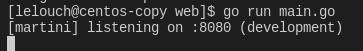
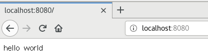
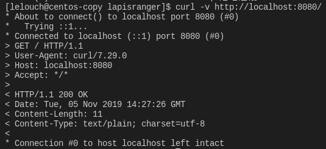
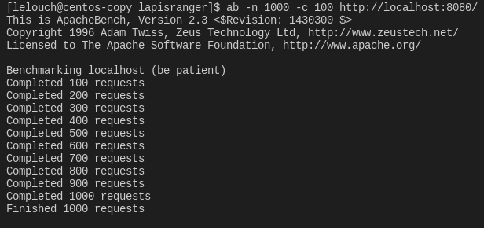
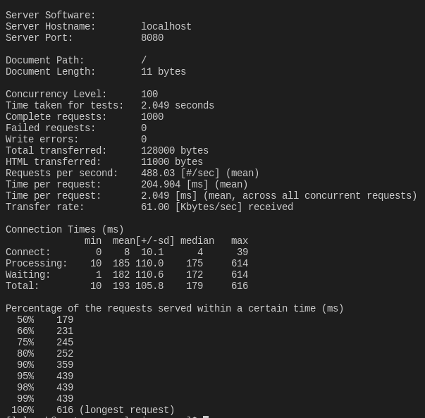
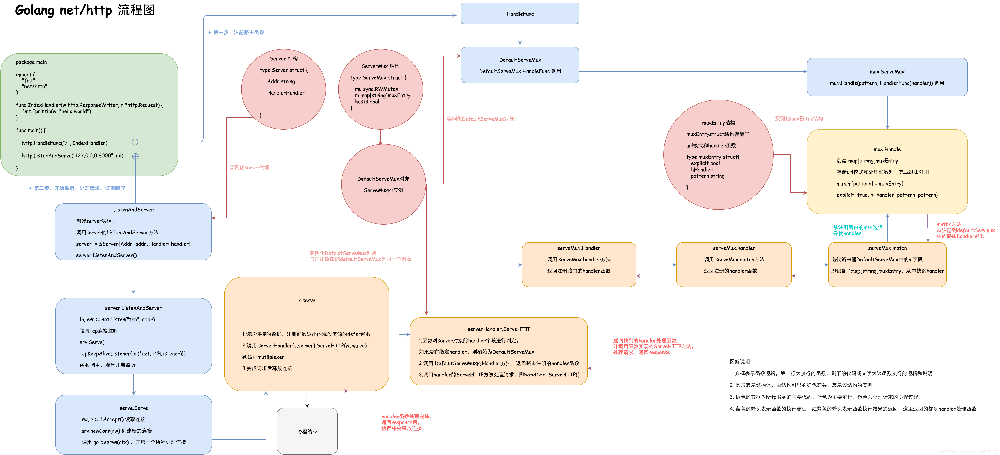
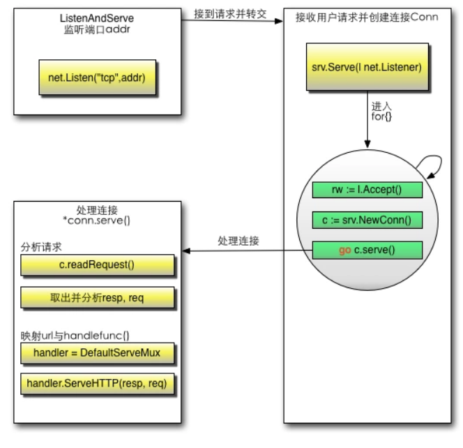

[TOC]


## 开发 web 服务程序

### 1、概述

开发简单 web 服务程序 cloudgo，了解 web 服务器工作原理。

**任务目标**

1. 熟悉 go 服务器工作原理
2. 基于现有 web 库，编写一个简单 web 应用类似 cloudgo。
3. 使用 curl 工具访问 web 程序
4. 对 web 执行压力测试

**相关知识**

课件：http://blog.csdn.net/pmlpml/article/details/78404838

### 2、任务要求

**基本要求**

1. 编程 web 服务程序 类似 cloudgo 应用。
   - 要求有详细的注释
   - 是否使用框架、选哪个框架自己决定 请在 README.md 说明你决策的依据
2. 使用 curl 测试，将测试结果写入 README.md
3. 使用 ab 测试，将测试结果写入 README.md。并解释重要参数。

**扩展要求**

选择以下一个或多个任务，以博客的形式提交。

1. 选择 net/http 源码，通过源码分析、解释一些关键功能实现
2. 选择简单的库，如 mux 等，通过源码分析、解释它是如何实现扩展的原理，包括一些 golang 程序设计技巧。
3. 在 docker hub 申请账号，从 github 构建 cloudgo 的 docker 镜像，最后在 Amazon 云容器服务中部署。
   - 实现 Github - Travis CI - Docker hub - Amazon “不落地”云软件开发流水线
4. 其他 web 开发话题

## 实验过程

选择martini框架进行开发.

Martini是一个强大的为了编写模块化Web应用而生的GO语言框架.

[github](<https://github.com/go-martini/martini>)

使用`go get github.com/go-martini/martini`安装

仿照老师的博客创建一个web项目

main.go

```go
package main

import (
	"os"

	"github.com/lapisranger/web/service"
	flag "github.com/spf13/pflag"
)

const (
	PORT string = "8080"
)

func main() {
	port := os.Getenv("PORT")
	if len(port) == 0 {
		port = PORT
	}

    //-p 设置端口号
	pPort := flag.StringP("port", "p", PORT, "PORT for httpd listening")
	flag.Parse()
	if len(*pPort) != 0 {
		port = *pPort
	}

	server := service.NewServer()
	server.RunOnAddr(":" + port)
}

```

service/server.go

```go
package service

import (
	"github.com/go-martini/martini"
)

// NewServer configures and returns a Server.
func NewServer() *martini.ClassicMartini {
	//return instance
	m := martini.Classic()

	//route
	m.Get("/", func(params martini.Params) string {
		return "hello world"
	})

	return m
}

```

这里的web服务只是简单的创建了一个服务器server实例,其类型为ClassicMartini,使用martini.Classic()创建,监听main.go中设置的端口port,并输出hello world,使用了简单的处理Get请求的函数,当路由为"/"时在页面上输出"hello world"

### 测试

使用`go run main.go`启动服务器

终端显示:



浏览器显示:



#### curl测试

新建一个终端,使用`curl -v http://localhost:8080/`命令

如果启动服务器时用了-p参数指定端口则这里也需要相应修改端口号



```
* About to connect() to localhost port 8080 (#0)
*   Trying ::1...
* Connected to localhost (::1) port 8080 (#0)
> GET / HTTP/1.1
> User-Agent: curl/7.29.0
> Host: localhost:8080
> Accept: */*
> 
< HTTP/1.1 200 OK
< Date: Tue, 05 Nov 2019 14:27:26 GMT
< Content-Length: 11
< Content-Type: text/plain; charset=utf-8
< 
* Connection #0 to host localhost left intact
```

向服务器发出请求序列,返回200,说明请求成功

#### ab测试

使用`ab -n 1000 -c 100 http://localhost:8080/`命令进行压力测试





```
This is ApacheBench, Version 2.3 <$Revision: 1430300 $>
Copyright 1996 Adam Twiss, Zeus Technology Ltd, http://www.zeustech.net/
Licensed to The Apache Software Foundation, http://www.apache.org/

Benchmarking localhost (be patient)
Completed 100 requests
Completed 200 requests
Completed 300 requests
Completed 400 requests
Completed 500 requests
Completed 600 requests
Completed 700 requests
Completed 800 requests
Completed 900 requests
Completed 1000 requests
Finished 1000 requests


Server Software:        
Server Hostname:        localhost
Server Port:            8080

Document Path:          /
Document Length:        11 bytes

Concurrency Level:      100
Time taken for tests:   2.049 seconds
Complete requests:      1000
Failed requests:        0
Write errors:           0
Total transferred:      128000 bytes
HTML transferred:       11000 bytes
Requests per second:    488.03 [#/sec] (mean)
Time per request:       204.904 [ms] (mean)
Time per request:       2.049 [ms] (mean, across all concurrent requests)
Transfer rate:          61.00 [Kbytes/sec] received

Connection Times (ms)
              min  mean[+/-sd] median   max
Connect:        0    8  10.1      4      39
Processing:    10  185 110.0    175     614
Waiting:        1  182 110.6    172     614
Total:         10  193 105.8    179     616

Percentage of the requests served within a certain time (ms)
  50%    179
  66%    231
  75%    245
  80%    252
  90%    359
  95%    439
  98%    439
  99%    439
 100%    616 (longest request)
```

测试结果中的参数字段及含义如下:

| 字段                                                    | 含义                                                         |
| :------------------------------------------------------ | :----------------------------------------------------------- |
| Server Hostname                                         | 服务器主机名                                                 |
| Server Port                                             | 服务器端口                                                   |
| Document Path                                           | 文件路径                                                     |
| Document Length                                         | 文件大小                                                     |
| Concurrency Level                                       | 并发等级                                                     |
| Requst per second                                       | 平均每秒的请求个数。服务器并发处理能力的量化描述，单位是reqs/s，指的是在某个并发用户数下单位时间内处理的请求数。某个并发用户数下单位时间内能处理的最大请求数，称之为最大吞吐率。 吞吐率是基于并发用户数的。这句话代表了两个含义： a、吞吐率和并发用户数相关。 b、不同的并发用户数下，吞吐率一般是不同的。 计算公式：总请求数/处理完成这些请求数所花费的时间，即：Request per second=Complete requests/Time taken for tests.这个数值表示当前机器的整体性能，值越大越好。 |
| Time per request                                        | 用户平均的等待时间。 计算公式：总请求数/处理完成这些请求数所花费的时间，即：Request per second=Complete requests/Time taken for tests.这个数值表示当前机器的整体性能，值越大越好。 |
| Time per request:across all concurrent requests         | 计算公式：处理完成所有请求数所花费的时间/总请求数，即：Time taken for/testsComplete requests. 可以看到，它是吞吐率的倒数。同时，它也等于用户平均请求等待时间/并发用户数，即Time per request/Concurrency Level。 |
| Connection Times                                        | 表内描述了所有的过程中所消耗的最小、中位、最长时间。         |
| Percentage of the requests served within a certain time | 每个百分段的请求完成所需的时间                               |

## net/http源码阅读

可以从sourcegraph网站上找到[net/http的源码](<https://sourcegraph.com/github.com/golang/go/-/tree/src/net/http>)

包含了大量文件,大部分包都有一个对应的test.go文件,还有一些示例的example文件.

http框架一图流



处理http请求的基本流程如下:



在理解http中，重点关注在server和client以及他们的交互流程

流程：`Client->Requests->router->handler->Response->Client`

- hander函数： 具有func(w http.ResponseWriter, r *http.Requests)签名的函数 

- handler处理器(函数): 经过HandlerFunc结构包装的handler函数，它实现了ServeHTTP接口方法的函数。调用handler处理器的ServeHTTP方法时，即调用handler函数本身

- handler对象：实现了Handler接口ServeHTTP方法的结构
  

### 1 简介

net/http库中的例子,创建一个简单的http server

```javascript
package main
 
import (
    "net/http"
    "fmt"
)
 
func Indexhandler(w http.ResponseWriter,r *http.Request)  {
    fmt.Fprintln(w,"hello world")
}
 
 
func main() {
    http.HandleFunc("/",Indexhandler)
    http.ListenAndServe("127.0.0.1",nil)
}
```

其中接口部分如下

```javascript
    type HandlerFunc func(ResponseWriter, *Request)
```

### 2 路由

```javascript
        type ServeMux struct {
            mu    sync.RWMutex
            m     map[string]muxEntry
            hosts bool // whether any patterns contain hostnames
        }

        type muxEntry struct {
            explicit bool
            h        Handler
            pattern  string
        }

        // NewServeMux allocates and returns a new ServeMux.
        func NewServeMux() *ServeMux { return new(ServeMux) }

        // DefaultServeMux is the default ServeMux used by Serve.
        var DefaultServeMux = &defaultServeMux

        var defaultServeMux ServeMux 
```

ServerMux则是一个http路由struct。里面的map包含了一个路由hash表。

另外上面的代码中，也形成了一个DefaultServeMux，默认的路由对象。

```javascript
    type ServeMux
        func NewServeMux() *ServeMux
        func (mux *ServeMux) Handle(pattern string, handler Handler)
        func (mux *ServeMux) HandleFunc(pattern string, handler func(ResponseWriter, *Request))
        func (mux *ServeMux) Handler(r *Request) (h Handler, pattern string)
        func (mux *ServeMux) ServeHTTP(w ResponseWriter, r *Request)
```

#### 2.1 Handle

```javascript
    func (mux *ServeMux) Handle(pattern string, handler Handler)
```

这个函数为注册路由表函数，功能就是创建muxEntry，然后将其放入到路由map中

```javascript
    func (mux *ServeMux) Handle(pattern string, handler Handler) {
            mux.mu.Lock()
            defer mux.mu.Unlock()

            if pattern == "" {
                panic("http: invalid pattern " + pattern)
            }
            if handler == nil {
                panic("http: nil handler")
            }
            if mux.m[pattern].explicit {
                panic("http: multiple registrations for " + pattern)
            }

            if mux.m == nil {
                mux.m = make(map[string]muxEntry)
            }

            //主要的地方就是在这里
            mux.m[pattern] = muxEntry{explicit: true, h: handler, pattern: pattern}

            if pattern[0] != '/' {
                mux.hosts = true
            }

            // Helpful behavior:
            // If pattern is /tree/, insert an implicit permanent redirect for /tree.
            // It can be overridden by an explicit registration.
            n := len(pattern)
            if n > 0 && pattern[n-1] == '/' && !mux.m[pattern[0:n-1]].explicit {
                // If pattern contains a host name, strip it and use remaining
                // path for redirect.
                path := pattern
                if pattern[0] != '/' {
                    // In pattern, at least the last character is a '/', so
                    // strings.Index can't be -1.
                    path = pattern[strings.Index(pattern, "/"):]
                }
                url := &url.URL{Path: path}
                mux.m[pattern[0:n-1]] = muxEntry{h: RedirectHandler(url.String(), StatusMovedPermanently), pattern: pattern}
            }
        }
```

#### 2.2 HandleFunc

HandleFunc就是对Handle的封装

```javascript
    func (mux *ServeMux) HandleFunc(pattern string, handler func(ResponseWriter, *Request)) {
        mux.Handle(pattern, HandlerFunc(handler))
    }
```

#### 2.3 Handler

Handler则是根据request的访问路径，查找相关的路由表，得到处理函数

```javascript
        func (mux *ServeMux) Handler(r *Request) (h Handler, pattern string) {
            if r.Method != "CONNECT" {
                if p := cleanPath(r.URL.Path); p != r.URL.Path {
                    _, pattern = mux.handler(r.Host, p)
                    url := *r.URL
                    url.Path = p
                    return RedirectHandler(url.String(), StatusMovedPermanently), pattern
                }
            }

            return mux.handler(r.Host, r.URL.Path)
        }


        func (mux *ServeMux) handler(host, path string) (h Handler, pattern string) {
            mux.mu.RLock()
            defer mux.mu.RUnlock()

            // Host-specific pattern takes precedence over generic ones
            if mux.hosts {
                h, pattern = mux.match(host + path)
            }
            if h == nil {
                h, pattern = mux.match(path)
            }
            if h == nil {
                h, pattern = NotFoundHandler(), ""
            }
            return
        }
```

#### 2.4 ServeHTTP

ServerHttp则是路由的入口

```javascript
    func (mux *ServeMux) ServeHTTP(w ResponseWriter, r *Request) {
    //下面是处理url路径
        if r.RequestURI == "*" {
            if r.ProtoAtLeast(1, 1) {
                w.Header().Set("Connection", "close")
            }
            w.WriteHeader(StatusBadRequest)
            return
        }
        //查找handler
        h, _ := mux.Handler(r)
        //具体的处理
        h.ServeHTTP(w, r)
    }
```

#### 2.5 DefaultServeMux

默认路由，只是对DefaultServeMux的一层封装

```javascript
        func Handle(pattern string, handler Handler) { DefaultServeMux.Handle(pattern, handler) }
        func HandleFunc(pattern string, handler func(ResponseWriter, *Request)) {
                DefaultServeMux.HandleFunc(pattern, handler)
            }
```

### 3 Server

入口，创建并监听。

其实是创建了一个Server对象

```javascript
        func ListenAndServe(addr string, handler Handler) error {
            server := &Server{Addr: addr, Handler: handler}
            return server.ListenAndServe()
        }
```

server提供如下操作

```javascript
    type Server
        func (srv *Server) ListenAndServe() error
        func (srv *Server) ListenAndServeTLS(certFile, keyFile string) error
        func (srv *Server) Serve(l net.Listener) error
        func (srv *Server) SetKeepAlivesEnabled(v bool)
```


#### 3.1 ListenAndServe

```javascript
        func (srv *Server) ListenAndServe() error {
            addr := srv.Addr
            if addr == "" {
                addr = ":http"
            }
            ln, err := net.Listen("tcp", addr)
            if err != nil {
                return err
            }
            return srv.Serve(tcpKeepAliveListener{ln.(*net.TCPListener)})
        }
```

其中Listen返回的是一个Listener接口

```javascript
        func Listen(net, laddr string) (Listener, error)

        type Listener interface {
            // Accept waits for and returns the next connection to the listener.
            Accept() (Conn, error)

            // Close closes the listener.
            // Any blocked Accept operations will be unblocked and return errors.
            Close() error

            // Addr returns the listener's network address.
            Addr() Addr
    }
```

#### 3.2 Serve

真正的入口处

步骤：Accept–>srv.newConn–>c.serve(ctx)

```javascript
        func (srv *Server) Serve(l net.Listener) error {
            defer l.Close()
            if fn := testHookServerServe; fn != nil {
                fn(srv, l)
            }
            var tempDelay time.Duration // how long to sleep on accept failure

            if err := srv.setupHTTP2_Serve(); err != nil {
                return err
            }

            // TODO: allow changing base context? can't imagine concrete
            // use cases yet.
            baseCtx := context.Background()
            ctx := context.WithValue(baseCtx, ServerContextKey, srv)
            ctx = context.WithValue(ctx, LocalAddrContextKey, l.Addr())
            for {
            //调用Accept监听
                rw, e := l.Accept()
                if e != nil {
                    if ne, ok := e.(net.Error); ok && ne.Temporary() {
                        if tempDelay == 0 {
                            tempDelay = 5 * time.Millisecond
                        } else {
                            tempDelay *= 2
                        }
                        if max := 1 * time.Second; tempDelay > max {
                            tempDelay = max
                        }
                        srv.logf("http: Accept error: %v; retrying in %v", e, tempDelay)
                        time.Sleep(tempDelay)
                        continue
                    }
                    return e
                }
                tempDelay = 0
                //获取新的链接
                c := srv.newConn(rw)
                c.setState(c.rwc, StateNew) // before Serve can return
                //链接的处理处
                go c.serve(ctx)
            }
        }
```

### 4 conn

#### 4.1 newConn

创建了一个conn

```javascript
        func (srv *Server) newConn(rwc net.Conn) *conn {
            c := &conn{
                server: srv,
                rwc:    rwc,
            }
            if debugServerConnections {
                c.rwc = newLoggingConn("server", c.rwc)
            }
            return c
        }
```

#### 4.2 serve

conn里读取数据，然后进行处理

```javascript
    // Serve a new connection.
    func (c *conn) serve(ctx context.Context) {
        c.remoteAddr = c.rwc.RemoteAddr().String()
        ...
        c.r = &connReader{r: c.rwc}
        c.bufr = newBufioReader(c.r)
        c.bufw = newBufioWriterSize(checkConnErrorWriter{c}, 4<<10)

        ctx, cancelCtx := context.WithCancel(ctx)
        defer cancelCtx()

        for {
            w, err := c.readRequest(ctx)

            ...
            //真正的处理地方
            serverHandler{c.server}.ServeHTTP(w, w.req)
            w.cancelCtx()
            if c.hijacked() {
                return
            }
            w.finishRequest()
            if !w.shouldReuseConnection() {
                if w.requestBodyLimitHit || w.closedRequestBodyEarly() {
                    c.closeWriteAndWait()
                }
                return
            }
            c.setState(c.rwc, StateIdle)
        }
    }
```

#### 4.3 ServeHTTP

最终的地方。通过寻找路由，找到路由处理函数，然后对请求信息做响应处理。

```javascript
    type serverHandler struct {
        srv *Server
    }

    func (sh serverHandler) ServeHTTP(rw ResponseWriter, req *Request) {
        handler := sh.srv.Handler
        //nil则利用默认的路由
        if handler == nil {
            handler = DefaultServeMux
        }
        if req.RequestURI == "*" && req.Method == "OPTIONS" {
            handler = globalOptionsHandler{}
        }
        handler.ServeHTTP(rw, req)
    }
```

### 5 总结

- 路由部分，构建map来存储路由处理函数
- 链接处理部分，构建一个tcp listener，然后accept，构建conn
- 然后通过conn，查找路由，找到处理函数，进行处理

### 参考

[GO-net/http源码阅读](https://segmentfault.com/a/1190000017036460)

[golang-net/http源码分析之http server](<https://cloud.tencent.com/developer/article/1052469>)

[Go 源码学习之--net/http](https://www.cnblogs.com/zhaof/p/8569743.html)